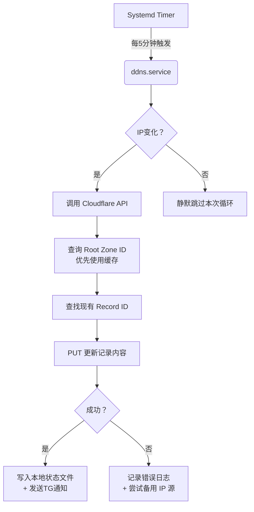

# 🚀 Cloudflare DDNS 一键脚本（最终修正版）

> **📌 项目简介**  
> 一个专为 Debian/Ubuntu 系统设计的自动化 DDNS 工具，可实时同步公网 IP 至 Cloudflare DNS 记录，支持 IPv4/IPv6 双协议、Telegram 即时通知、ZoneID 缓存优化及严格的安全加固机制。


## ✨ 核心特性

| 功能模块 | 说明 |
|---------|------|
| 🔁 **智能IP检测** | 自动从多个权威源获取 IPv4/IPv6 地址，内置正则校验防止无效数据 |
| ⚡ **性能优化** | ZoneID 缓存机制减少 API 请求频率，降低 Cloudflare 限流风险 |
| 🛡️ **安全加固** | 配置文件权限锁定为 600，独立状态文件隔离，日志脱敏处理 |
| 💬 **Telegram 通知** | IP 变更时自动推送消息，支持自定义 Bot Token 和 Chat ID |
| 🔄 **容错设计** | 多 API 降级策略（ipify → ip.sb → icanhazip），失败自动切换 |
| 🕒 **定时任务** | systemd timer 每 5 分钟执行一次，开机自启无感运行 |
| 🧹 **完整生命周期管理** | 一键安装/卸载、配置修改、日志查看、手动触发测试 |

---

## 📦 快速开始

### 前提条件
- ✅ 操作系统：Debian 10+ / Ubuntu 18.04+
- ✅ 用户权限：root 或 sudo 权限
- ✅ 必要组件：已提前安装 `curl` 和 `jq`（脚本会自动检测补装）
- ✅ Cloudflare 账号：拥有 [Global API Key](https://dash.cloudflare.com/profile/api-tokens)

### 安装步骤
```bash
# 下载脚本并赋予执行权限
chmod +x ddns.sh

# 以 root 身份运行（首次运行将引导完整配置流程）
sudo ./ddns.sh
```
### 一键安装

```bash
wget -O ddns.sh https://raw.githubusercontent.com/chinggirltube/ddns/refs/heads/main/ddns.sh && bash ddns.sh
```

#### 首次运行交互流程
1. **环境检查**：验证系统及依赖包
2. **自动安装**：创建 `/etc/DDNS` 工作区与 systemd 服务
3. **交互式配置向导**：
   - 输入 Cloudflare 邮箱与 Global API Key
   - 设置要解析的 IPv4/IPv6 域名（如 `v4.example.com`, `v6.example.com`）
   - 可选配置 Telegram 通知参数
4. **自动启用服务**：启动 timer 并开始首轮检测

> 💡 提示：若中途退出，后续可通过命令 `ddns` 重新进入管理菜单

---

## ⚙️ 配置详解

### 1. 主配置文件位置
```bash
/etc/DDNS/.config  # 权限 600，仅限 root 读写
```

### 2. 配置项说明
| 字段                 | 含义                              | 示例                                        | 必填 |
| -------------------- | --------------------------------- | ------------------------------------------- | ---- |
| `Domain`             | IPv4 待解析域名                   | `home.yourdomain.com`                       | 否*  |
| `Domainv6`           | IPv6 待解析域名                   | `home6.yourdomain.com`                      | 否*  |
| `Email`              | Cloudflare 注册邮箱               | `user@example.com`                          | ✅    |
| `Api_key`            | Cloudflare Global API Key         | `abc123def456...`                           | ✅    |
| `Telegram_Bot_Token` | TG 机器人令牌（空值则禁用通知）   | `123456:ABC-DEF1234ghIkl-zyx57W2v1u123ew11` | 否   |
| `Telegram_Chat_ID`   | TG 接收者 Chat ID（负数代表群组） | `-1001234567890`                            | 否   |

> *注：至少需配置 Domain 或 Domainv6 其一，否则更新逻辑不会执行

### 3. 其他关键文件
| 路径                  | 用途                 | 权限 |
| --------------------- | -------------------- | ---- |
| `/etc/DDNS/DDNS`      | 核心执行逻辑脚本     | 700  |
| `/etc/DDNS/.old_ipv4` | 上次成功的 IPv4 快照 | 600  |
| `/etc/DDNS/.old_ipv6` | 上次成功的 IPv6 快照 | 600  |
| `/var/log/ddns.log`   | 运行时日志文件       | 644  |

---

## 🎯 常用操作指南

通过终端输入 `ddns` 即可调出管理菜单：

```text
请选择一个操作： 
1：启动 / 重启 DDNS 
2：停止 DDNS 
3：修改要解析的域名 
4：修改 Cloudflare API 
5：配置 Telegram 通知 
6：彻底卸载 DDNS 
7：查看 DDNS 实时日志 
8：测试 Telegram 通知 
9：立即手动执行一次DDNS检查 
0：退出脚本
```

### 场景化操作建议

#### 🔍 查看当前运行状态
```bash
systemctl status ddns.timer
tail -n 20 /var/log/ddns.log
```

#### 🆘 调试常见报错
- **“无法获取 Zone ID”** → 检查邮箱/API Key 是否正确；确认根域名已在 CF 后台添加
- **"HTTP Code 403"** → API Key 权限不足（需含 Zone.DNS Edit 权限）
- **Telegram 发送失败** → 先用选项 `8` 测试连通性；检查 Chat ID 是否为负数格式

#### ♻️ 恢复默认设置（保留配置）
```bash
sudo systemctl restart ddns.service
# 强制触发一次全量重检
```

#### 🗑️ 完全卸载（清除所有痕迹）
```bash
ddns  # 选择选项 6 -> 输入 y 确认
# 系统将自动删除：/etc/DDNS, /usr/bin/ddns, timer/service unit 文件
```

---

## 🔐 安全最佳实践

1. **最小权限原则**  
   - `.config` 文件始终设置为 `chmod 600`
   - 日志中敏感信息（如 API Key）不会明文打印
   - 进程仅以 root 启动但内部变量局部作用域隔离

2. **API 密钥轮换提醒**  
   > ⚠️ 建议每 90 天更换一次 Global API Key  
   > 操作流程：CF Dashboard → Profile → API Tokens → Revoke旧Key → 生成新Key → 用选项 `4` 更新配置

3. **网络暴露面控制**  
   - 本脚本**不开放任何监听端口**，仅主动向外发起 HTTPS 请求
   - 防火墙只需放行出站 `api.cloudflare.com:443` 和 `api.ipify.org:443`

---

## 📊 技术架构亮点



### 关键技术创新点
- **缓存策略**：内存级 ZoneID 字典存储 (`declare -A ZONE_ID_CACHE`)，避免重复 HTTP 请求
- **渐进式验证**：三重 IP 源兜底 + 正则双重校验（IPv4/IPv6 格式）
- **原子性写入**：先更新临时文件再 move，防止并发写入导致脏数据
- **优雅降级**：任一环节失败不影响整体流程继续执行其他子任务

---

